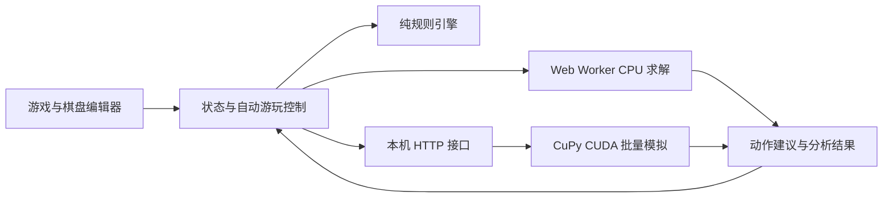

# 2048 AI 二次开发项目计划

实施补充（2026-10-01）：新增 TAS 离线路线规划，包括固定真实 RNG 及主动选择理想出块两种条件；目标块优化最少步数，得分优化有限 H 最高分，支持预览、执行、恢复及路线 JSON。普通 AI 仍独立于真实 RNG。新增 TAS 运行验收由使用者完成。

日期：2026-10-01

上游：[gabrielecirulli/2048](https://github.com/gabrielecirulli/2048)
工作目录：`D:\project\coding\2048ai`

本次交付项目计划。GitHub Fork、上游代码导入、依赖安装及功能开发在后续实施阶段完成。

## 1. 项目目标与范围

在原版 2048 上增加 AI 控制和棋盘分析，保留原版玩法、视觉风格与合并动画。交付两种运行方式：

- **浏览器版**：无需 Python 或显卡，使用 CPU 自动游玩、编辑棋盘、分析下一步、保存与回放。
- **本机 CUDA 增强版**：浏览器连接本机计算服务，使用 NVIDIA GPU 批量模拟，支持 CPU / CUDA / 自动选择。

首版支持 2×2 到 6×6 的正方形棋盘，默认 4×4；允许手工编辑任意格子、粘贴数字矩阵、导入和导出 JSON。目标块可配置，例如 2048、4096、8192；允许达标后继续游玩。更大棋盘、矩形、障碍格和自定义出块规则留到后续版本。

“自动化游玩”通过应用内部状态和动作接口完成。AI 读取棋盘快照、计算方向、调用游戏引擎；不依赖模拟键盘或识别屏幕。

## 2. “最优解”的定义

经典 2048 每次有效移动后会随机出块，因此普通棋盘无法预先给出一条保证成功的完整路径。求解器默认计算**当前状态下的最佳建议动作**，实际出块后重新求解。

提供两个目标：提高得分；提高指定步数内达到目标块的概率。两者单独配置和评测，不能把启发式评分显示成真实胜率。

| 模式 | 方法与结果 | 保证范围 |
| --- | --- | --- |
| 实时游玩，默认 | 限时 Expectimax，输出建议方向、各方向估值、深度与耗时 | 深度截断与启发式估值，属于近似决策 |
| CUDA / CPU 模拟 | 各合法方向执行多条后续模拟，返回平均收益；目标模式返回样本达标率与置信区间 | 对指定后续策略的统计估计，不能称为全局最优 |
| 有限步精确分析 | 给定步数 H，完整枚举动作和随机出块分支，优化 H 步内期望累计合并得分或达标概率 | 只在给定规则、目标和 H 内最优；使用明确数值容差 |

精确分析优先开放给 2×2、3×3 和较浅的 4×4 搜索。达到节点、内存或时间上限时返回“未完成”，不能将部分搜索标为精确最优。精确模式不使用启发式叶子分数、概率截断或随机采样。

固定随机种子用于复现一局游戏和比较算法。求解器不能读取实际游戏的未来随机状态；固定种子并不意味着 AI 可以提前知道出块。回放展示已经发生的路径，不能当作对新随机局面的保证。

## 3. 上游复用与改造

上游使用 MIT 许可证，二开保留版权、许可证与来源说明。[上游仓库](https://github.com/gabrielecirulli/2048)

已核验的主要改造点：

- `GameManager.move()` 同时执行规则、随机出块和显示更新。抽离纯规则引擎，搜索不能调用会修改真实游戏的移动方法。
- 上游 `cells[x][y]` 为列优先；对外矩阵统一为行优先 `board[row][column]`，适配层明确转换。
- 继承方向和合并语义：每块每步最多合并一次，分数增加合并后的块值，无效移动不出块。
- 保留经典出块规则：空位均匀选择，2 的概率 90%，4 的概率 10%；随机生成从确定性移动中分离。
- 棋盘背景、位置样式和启动尺寸存在 4×4 假设，需要动态生成布局。
- 统一加载棋盘、尺寸、目标和胜负状态，避免导入已达标或已死局的棋盘后状态不正确。
- 隔离或迁移旧存档；编辑模式屏蔽游戏快捷键；继续游玩的布尔状态和方法使用不同名称。

源码依据：[GameManager](https://github.com/gabrielecirulli/2048/blob/master/js/game_manager.js)、[Grid](https://github.com/gabrielecirulli/2048/blob/master/js/grid.js)、[页面结构](https://github.com/gabrielecirulli/2048/blob/master/index.html)、[棋盘样式](https://github.com/gabrielecirulli/2048/blob/master/style/main.scss)。实施前固定具体上游提交，后续测试和文档都以该提交为基准。

## 4. 技术架构

建议使用 TypeScript + Vite 管理浏览器代码，保留原版页面和视觉，不引入大型 UI 框架。CPU 搜索放在 Web Worker 中；CUDA 服务使用 Python + FastAPI + CuPy，自定义模拟内核使用 CUDA C。



浏览器通过本机 HTTP 服务使用 CUDA。这是工程部署方案；纯浏览器版本仍可独立运行。增强版服务默认绑定 `127.0.0.1`，正式本机运行时由服务提供构建后的页面和 API，避免额外跨域配置。初版使用 HTTP；持续任务进度需要时再加入 WebSocket。

建议目录：

```text
index.html / style/ / meta/   原版页面与资产及改造后的布局
src/core/                    棋盘、移动、出块、随机数、序列化
src/game/                    原版 UI 适配、存档、动画
src/ai/                      评价函数、Expectimax、CPU 模拟、Worker
src/ui/                      控制面板、棋盘编辑、分析与回放
server/                      本机 API、设备探测、任务管理
server/cuda/                 批量模拟和归约内核
tests/fixtures/              共享规则样例和棋盘集合
benchmarks/                  固定种子评测与结果
docs/                        协议、安装和使用说明
```

核心接口：

- `applyMove(board, direction)` → 新棋盘、是否变化、增加分数、动画所需合并信息；不随机出块、不修改输入。
- `spawnTile(board, rng)` → 新棋盘与出块记录；真实游戏 RNG 与搜索 RNG 独立。
- `solve(snapshot, options)` → 建议方向、各合法方向估值、算法、实际后端、完成状态、耗时和搜索量。
- JSON 统一记录协议版本、行优先棋盘、尺寸、目标、出块规则与求解预算；存档另外记录真实游戏 RNG 状态。

每个搜索请求带棋盘版本和请求 ID。暂停、编辑、撤销、重开、手动移动后立即使旧请求失效；返回结果只能作用于它对应的棋盘。CUDA 任务分批计算，支持批次间取消，避免长内核持续占用显示显卡。

通用状态使用方块指数的紧凑数组。4×4 专用行查表或位棋盘作为后续优化，必须处理表示范围溢出并回退到通用实现；不让优化限制自定义棋盘和大方块。

## 5. 用户功能

**自动游玩控制**

- 开始、暂停、单步、停止；可调整移动间隔和单步计算预算。
- 选择算法、CPU / CUDA / 自动后端，展示实际使用的后端。
- 到目标块后停止或继续；无合法动作时结束。
- 手动操作接管后暂停 AI，避免人工输入与自动移动互相覆盖。

**自定义棋盘**

- 选择尺寸，逐格输入；0 表示空格，其余必须为允许范围内的 2 的幂。
- 粘贴行优先矩阵、清空、导入/导出 JSON，明确报出非法格子和维度问题。
- 加载自定义棋盘时不额外生成初始块；“新随机游戏”按经典规则生成两块。
- 单步移动后仍按经典规则出块；“分析”只读取当前棋盘。
- 撤销和回放恢复棋盘、分数与 RNG 状态，保证继续操作可复现。

**分析面板**

- 展示四方向是否可用、建议方向、估值、实际深度/轨迹数、耗时及是否触及预算。
- 精确模式明确显示目标、H、完整性和数值容差；近似模式明确标注估计。
- 随机模拟的概率结果同时展示样本量与置信区间；启发式模式展示评分。
- 批量评测导出配置、种子、得分、最大块、达标率和耗时统计。

## 6. CPU 与 CUDA 求解路线

CPU 首版采用 Expectimax：动作节点取最大值，随机节点按出块概率加权，叶子评价综合空位数、单调性、平滑度、可合并性和大块位置。使用迭代加深、缓存和时间预算，返回最后一次完整完成的搜索层。缓存键包含棋盘、节点类型、剩余深度、规则和评价配置，避免错误复用。

先让通用引擎和 Worker 可用，再根据 profiling 加入 4×4 行变换查表、减少临时对象和缓存开销。接近预算时降低计算量；仍有合法动作时始终提供可用结果。精确模式使用独立的完整枚举路径，预算不足时保留未完成状态。

CUDA 优先实现**按候选方向并行的 Monte Carlo rollout**：对每个合法首步生成多条独立轨迹，在 GPU 内完成移动、随机出块、后续策略和收益累计，再归约返回统计结果。后续策略先用明确的轻量启发式贪心策略，CPU 与 GPU 采用相同策略和终止条件。纯随机策略只作为弱基线。

实时 CPU Expectimax 和 CUDA rollout 是两种算法，需要分别评价速度和质量。CUDA 性能结论必须与同算法的优化 CPU rollout 比较，不能把换算法后的差异归因于 GPU。

本机已只读检测到 **NVIDIA GeForce GTX 1660 SUPER，6144 MiB 显存，驱动 617.14**。尚未验证 CuPy、CUDA 运行库或自定义 kernel 是否可用；实施阶段先做环境探测、版本锁定、分配和内核自检。CuPy 提供 Windows wheel 和自定义 RawKernel 能力。[安装文档](https://docs.cupy.dev/en/stable/install.html)、[RawKernel 文档](https://docs.cupy.dev/en/stable/reference/generated/cupy.RawKernel.html)

不预先承诺 CUDA 加速倍数。4×4 浅搜索可能被服务通信和调度开销抵消；重点测试大批量轨迹、多棋盘评测和较长模拟。在此机器上测出批量规模与延迟的收益边界，自动后端按实测阈值选择。服务断开或 GPU 出错时，交互任务回退到 CPU 并标明原因；明确指定后端的 benchmark 则记录失败，不能悄悄换后端。

## 7. 实施里程碑

| 阶段 | 工作与交付 | 通过条件 |
| --- | --- | --- |
| M0：建立二开仓库 | GitHub Fork；本地保留 `origin` 与 `upstream`；固定上游提交；保留 MIT 和署名；建立构建入口 | 原版可启动，来源与远程关系明确 |
| M1：规则与棋盘 | 纯规则引擎、可复现 RNG、动态尺寸、编辑和 JSON 导入导出、存档 | 规则对照通过；2×2—6×6 编辑和恢复正确 |
| M2：自动游玩 MVP | Worker、限时 Expectimax、控制面板、单步分析、取消和手动接管 | 无需 Python 即可从随机或自定义棋盘连续游玩，UI 可随时暂停 |
| M3：分析与基线 | 有限步精确模式、回放、CPU rollout、固定种子批量评测 | 精确小案例与穷举一致；评测可重复运行并导出数据 |
| M4：CUDA 增强 | 本机服务、自检、模拟内核、GPU 统计、CPU 回退与自动选择 | CPU/GPU 规则一致；在本机完成同算法性能与质量报告 |
| M5：交付整理 | Windows 启动脚本、CPU/GPU 两套安装说明、演示棋盘、验收报告 | 按文档可启动；缺少 CUDA 时浏览器版仍完整可用 |

依赖顺序：M0 → M1 → M2 → M3 → M4 → M5。M2 是第一份可直接体验的版本；M4 在 CPU 基线成立后进行，避免先投入 GPU 而没有可比较的正确实现。

## 8. 验证与验收

规则验证覆盖四方向、一次合并约束、分数、无效移动、死局、已达目标、不同尺寸和大块范围。必须包含 `[2,2,2,2] → [4,4,0,0]` 得分增加 8、`[2,2,4,0] → [4,4,0,0]` 得分增加 4 等防止连续合并的案例。

以固定上游提交作 4×4 确定性移动对照，隔离随机生成；增加随机棋盘对照和旋转/镜像等性质检查。GPU 规则实现与通用 CPU 引擎共享测试样例，比较棋盘、有效移动和分数。统一种子派生与轨迹编号；单条轨迹尽量可对照，浮点归约结果用容差比较。

控制验证覆盖搜索中暂停、重开、编辑、手动移动、撤销，以及服务离线和 GPU 任务失败。旧结果不得落到新棋盘，UI 动画不影响逻辑正确性。

质量报告使用固定种子集合和多个独立批次，报告平均/中位得分、最大块分布、2048/4096/8192 达标率与置信区间。调参种子和最终评测种子分离；先跑约 100 局建立基线，再根据统计不确定性扩大样本，不先承诺未经测量的胜率。

性能报告包含浏览器请求到结果的端到端 P50/P95、搜索节点或模拟轨迹吞吐、显存和峰值内存。GPU 首次编译、冷启动和预热后耗时分开记录；内核计时使用 CUDA event 或同步，包含服务通信、拷贝和归约开销。[CuPy 性能指南](https://docs.cupy.dev/en/stable/user_guide/performance.html)

交互预算先提供 50/200/1000 ms 三档，作为可调目标；大棋盘和精确分析允许更长的可取消任务。以本机实测校准预算与超时余量。CUDA 默认启用的前提是正确性通过，并在目标工作负载下获得可重复的端到端收益。

## 9. 首版边界与后续扩展

首版完成可玩、可编辑、可分析、可复现，以及可选 CUDA。性能不足时优先保证可取消和结果标签准确。

后续可扩展 7×7/8×8 或矩形棋盘、定制出块规则、MCTS、学习型评价函数、离线训练、浏览器 WebGPU 和批量策略调参。它们不阻塞首版交付；强化学习训练和额外 GPU 框架先不作为基础依赖。

最终交付包括二开仓库、浏览器构建产物、本机 CUDA 服务、启动脚本、使用说明、规则核验和 CPU/GPU benchmark 报告。所有“最优”“胜率”“加速”结论都附上目标、预算、算法和实测条件。
