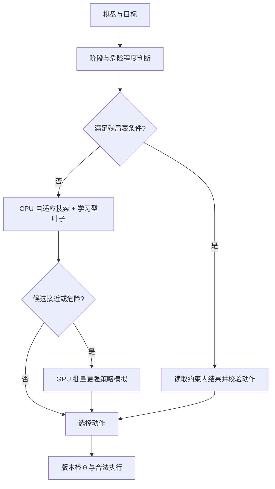

# 2048 全面胜率提升方案

日期：2026-10-01。方案代码基点：`3c0a2c4`。P0/P1 已实施：独立 Strong 搜索与成对评测入口，使用说明见 [P0/P1 指南](WIN_RATE_GUIDE.md)。目前仅完成构建和静态核验，未运行新版游戏/胜率评测或模型训练；后续阶段仍为提案。

## 1. 推荐路线与范围

推荐主线：**改进现有搜索 → 学习型局面评分 → 更强 GPU 后续策略 → 小范围残局求解**。保留现有 Expectimax、CPU/CUDA Rollout、有限步 exact、固定 RNG TAS 和理想出块 TAS，新增一个统一调度的「强力模式」。

普通玩法以经典 4×4 为首要优化对象：随机空位、2/4 概率 90%/10%、不撤销、不读取真实未来 RNG。分别统计 2048、4096、8192、16384、32768、65536 达到率。自定义存档另设续玩成功率；2×2、3×3、5×5、6×6 保留通用算法，不能直接套用只为 4×4 训练的模型。

2048 达到率争取向 99% 以上推进，这是工程目标，具体收益由新基线和留出评测确认。高阶目标先看相同预算下的达到率改善和置信区间。固定 RNG TAS 报可达路线，理想 TAS 报可控出块路线，两者独立于普通玩法胜率。

## 2. 当前真正限制胜率的地方

| 当前状态 | 对胜率的影响 | 改造入口 |
| --- | --- | --- |
| 默认 Expectimax 使用手工评分与即时合并奖赏 | 偏好的形状不一定能长期存活或完成目标 | `src/ai/solver.ts`、`evaluation.ts` |
| Rollout 后续每步均使用固定 greedy | 更多样本让固定策略的估计更稳定，但不能消除策略本身的弱点 | TS、Numba、CUDA 后续策略 |
| target 只统计 H 步内的 0/1 达标 | 远目标可能四方向全零；增加样本也无法改变结构性不可达 | 目标口径、截断叶子、规划阶段 |
| chance 节点完整展开空位×2，耗尽预算后只保留完整层 | 请求深度较大，实际完成深度仍可能很浅 | 自适应深度、状态缓存、近似搜索 |
| 静态评分只有有限阶段变化，没有专用残局模块 | 大块占位、合并通道、低空位危险局面处理不足 | 阶段价值、残局识别和求解 |
| 现有整局评测只覆盖一种固定配置 | 缺少当前版本基线、失败原因及各模式公平对照 | `benchmarks/` |

已有性能优化提供了更多计算空间：浏览器 Rollout 最多4路 Worker；本机 Numba 配置16线程；CUDA 专用尺寸内核与自适应批次。它们尚未提供新版整局胜率证据。

历史报告仅供定位：优化前100局、Expectimax 深度3、10000节点，2048=79/100、4096=26/100、8192=0/100。这个配置也不同于当前界面默认值，不能当作 `3c0a2c4` 的当前胜率。来源：[历史报告](../benchmarks/cpu-results.json)、[实施记录](VALIDATION.md)。

## 3. P0：统一胜率口径和评测入口

这一步提供后续比较依据，预计1个实施批次。我负责工具与静态检查，运行评测由使用者完成。

- 冻结当前版本作为对照；所有新策略记录代码版本、模型哈希、策略版本、完整参数、种子和硬件。
- 区分「有限 H 步达标概率」「到终局达到目标的整局胜率」「模型预测」。模型估值不能冒充概率；有限步 exact 保持原定义。
- 在相同初始种子、有效移动对应的相同 RNG 抽样流上做成对 A/B。动作不同会导致不同棋盘，评测不能强行沿用旧出块位置；每条路线仍按自己的空位生成规则推进。
- 同时比较固定计算预算和固定节点/样本预算：前者反映实际体验，后者帮助区分策略质量与性能收益。
- 首轮用100局排查明显回退；候选用1000局留出集。训练/调参/最终评测种子分离。接近99%的结论需要更多独立局数，不能靠100局全胜确认。
- 输出各目标达到率和95%区间、平均/中位分、P50/P95决策延迟、实际搜索深度/节点、模型及表命中率、失败局面与动作轨迹。
- 截断局、取消局和算法异常单独列出，不把尚未失败的截断局当成完整胜率样本。高阶续玩采用更长停止条件，不能统一用现有5000步限制。

自定义存档按最大块、空位、单调性和大块位置分层；该用户存档及 TAS 路线作为独立案例，不用一个案例代表随机胜率。

## 4. P1：先提升现有搜索的决策质量

这一步不依赖外部权重，预计1–2个实施批次。

**自适应搜索。** 依据空位数量、候选动作差距、大块阶段、下一次出块后的死局概率分配预算。宽松开局用较浅搜索；拥挤、出现高阶合并通道或候选接近时加深。记录实际完成层，并将开局、中盘、残局阈值作为配置，后续用留出集选择。

**风险和合并通道。** 增加下一次出块后无合法动作的概率、有效活动区域、最大两块的合并通道、蛇形中断和小块堵塞等特征。阶段权重通过离线调参选择。角落与蛇形保持软偏好，不能为了形状直接禁掉唯一可恢复的动作。

**改善目标信号。** 普通强力模式用目标相关的阶段价值处理尚未达标叶子，避免远目标全零时机械选择方向。原有 exact/rollout 的 H 步概率仍返回真实结果；辅助选择单独标注。明确区分总质量不足造成的 H 内不可达，与有限采样没有命中。

**近似搜索提效。** 为 Expectimax 增加对称状态归并、可复用且有容量上限的缓存和根方向并行；对称变换需保留方向映射，模型与目标约束也必须对称。只有近似模式可以尝试低概率分支截断，并记录阈值及截断质量；exact 和 TAS 最优性证明分支不作这种剪枝。

验收关注相同预算下的实际搜索深度、救回的失败局面和整局达到率。单独消融每项特征，收益不明或有回退时保持可关闭。

## 5. P2：接入学习型价值函数，作为主要质量升级

优先采用 **n-tuple TD afterstate**：评价「移动及合并后、随机出块前」的局面，选择即时合并收益加未来价值最大的动作，并作为搜索叶子。作者研究及官方项目提供了与 Expectimax、多阶段学习结合的依据；外部成绩不等于本项目成绩。[作者论文](https://arxiv.org/abs/2111.11090)、[TDL2048 官方项目](https://github.com/moporgic/TDL2048)。

实施分为两部分，预计2–3个接入批次；训练用时需另行实测。

1. 建立模型接口、格式转换与兼容检查。优先评估作者公开权重，记录来源、许可、网络结构、规则和编码。先使用较小模型实现推理，缺少相容权重时再训练基线模型。
2. 增加阶段模型，重点补足16384及以上局面。训练数据包含自然到达的中后盘和失败前状态；重启训练局面仅用于训练，正式整局评测仍从正常随机新局开始。

**价值类型必须一致。** 学习到的未来得分与真实合并分数同单位，不能直接加到当前任意量纲的手工评分上。afterstate 模型不能直接当成随机出块后的 state 模型；应在对应节点调用，或通过下一动作/出块展开转换。如果另训目标达标预测，则使用独立终止标签与校准，不将得分模型改名为胜率。

**模型规模预算。** 按4张6格 tuple 表、每格16种编码、float32推导，单阶段纯价值权重约 `4×16^6×4B=256MiB`；对称变换可以共享权重。阶段和训练累计量另占内存。首版控制在1–2阶段，模型一次加载并复用，不为每个 Worker 复制大模型；浏览器使用单模型 Worker 或按阶段加载，服务端共享只读权重。

**大块兼容。** 默认16种 tuple 编码无法直接表示指数16/17。真实棋盘与规则保持精确，模型清楚声明支持范围；超过范围时切换兼容模型/残局模块或现有评分。扩展编码会显著增加密集表体积。若试验论文的根节点降级方法，只转换模型输入或近似搜索副本，并单独评测，不能改变实际棋盘或 TAS 证明。[官方大块限制说明](https://github.com/moporgic/TDL2048#tile-downgrading)。

验收采用「纯模型 greedy」「模型+搜索」「现有手工评分」三组对照；同时检查大小块、旋转镜像、未知阶段、模型缺失和取消行为。先验证基本价值模型，再决定是否加入 TD(λ)、乐观初始化、更多阶段或目标预测模型。

## 6. P3：GPU 模拟更强的后续策略

完成模型接入后，再让 CPU/GPU Rollout 使用同一学习型策略，预计1–2个实施批次。

- 每次移动用 `实际合并收益 + afterstate未来价值` 选动作，保留随机生成与轨迹独立性。模型权重常驻设备；CPU/Numba/CUDA记录同一策略版本及编码。
- 截断 Rollout 可增加终点价值，但返回单独的「预测累计价值」，原有限 H 合并分和达标样本概率保留。出块后的状态先转换到正确的模型节点，不能直接误用 afterstate 权重。
- 先公平采样所有根方向，再向接近的候选分配更多样本。各方向样本量与置信区间单独记录；提前停止与择优偏差需要在评测中检查，最终正式性能对照使用固定样本预算。
- 可试验2–3种已验证策略的对照/集成，提高估计的稳健性；每种策略的样本结果独立记录。策略混合的成功率不是最优策略胜率。
- 浅层 CPU 搜索确定候选，GPU 对困难候选批量模拟；一次提交完整批次，避免每个小叶子一次 HTTP/设备调用。策略分歧时增加预算，而不是固定相信某个后端。

学习型查表可能受内存带宽限制，不能预设一定比当前评分内核快。分别测量策略质量、同算法CPU/GPU吞吐及端到端收益；设备利用率只是辅助指标。

## 7. P4：高阶残局专用处理

重点针对16384、32768、65536前的低空位与大块占位局面，预计2–3个实施批次，按覆盖量递增。

先实现残局识别和有限范围概率求解，再接入少量常见模式表。参考项目的 tablebase 只覆盖指定形态、位置与目标约束下的局面；查询前必须验证完整覆盖条件，未命中回退通用搜索。表内成功率是该残局约束下的结果，不能当成任意棋盘的全局最优概率。[官方残局手册](https://github.com/game-difficulty/2048EndgameTablebase/blob/main/docs_and_configs/help/helpZH.md)。

首版采用小表或蒸馏表，测量命中率及每种形态的失败原因；大表构建属于后续独立容量决策，不默认下载/生成 TB 级数据。参考项目区分小型蒸馏表和资源要求很高的完整表。[官方资源与蒸馏说明](https://github.com/game-difficulty/2048EndgameTablebase)。

大块固定条件不能靠「看起来像」判断。旋转、镜像、目标位置、出块规则、允许动作与离开模式的后果均需匹配；如果求解限制了动作集合，结论应明确限于该集合。对已进入残局的局面做成对成功率评测，并记录覆盖率，避免只展示命中的容易案例。

## 8. 独立补强 TAS 和存档续玩

普通随机玩法的价值模型也可用于 TAS 候选排序，但不替代证明。

- 固定 RNG 保留现有质量障碍检查；记录「上界」「已到达的最大块」「最短路线是否证明」。不将一次 beam 失败当作不可达。
- 理想出块把移动和合法2/4空位作为联合动作，增加目标质量进展、可合并通道和剩余空间的排序特征。质量余数只作策略条件，不能固定出4而漏掉必要出2。
- 分段续玩增加检查点、死路回退、禁用已失败分支与阶段目标，保存最终完整合法轨迹；区分回退次数与路线实际移动数。
- beam宽度与窗口自适应；较长任务可按根分支并行，统一预算、取消和去重。exact证明保留完整分支与保守下界，候选找到不标最短。
- 普通随机 tablebase、固定 RNG 和理想出块使用不同转移/价值语义，不能直接共用其成功概率。

## 9. 新「强力模式」的计算分工

模型不存在、编码不支持或服务离线时回退现有可用策略。新增模式返回决策来源、实际深度、策略/模型版本及估值类型。普通用户看到推荐动作、预算和简洁原因；详细搜索与模型诊断放分析面板。

## 10. 实施顺序与交付物

| 顺序 | 交付物 | 进入下一步的依据 |
| --- | --- | --- |
| P0 | 新基线配置、分层种子、成对评测及失败局面记录 | 使用者能复现当前质量与时延 |
| P1 | 强力模式骨架、自适应搜索、阶段/风险特征 | 相同预算下留出达到率改善，低阶目标无明确回退 |
| P2 | 版本化模型加载、afterstate评分、阶段模型、训练/转换入口 | 模型+搜索优于现有策略且内存/时延可接受 |
| P3 | CPU/GPU统一学习策略、批量复核与截断价值 | 强策略收益超过新增计算成本 |
| P4 | 覆盖可校验的小型残局模块 | 命中残局成功率改善，未覆盖局面仍能正常决策 |
| TAS | 检查点回退和阶段推进，独立路线报告 | 完整复算合法，证明与候选标签准确 |

首个实施阶段建议只做 **P0+P1**，随后优先 **P2**。不把训练大模型、构建全局表库和调整所有策略同时展开，否则难以归因收益。

所有变更保持原模式可选，参数与模型版本可回退；实现阶段由我完成代码、构建与静态核验，游戏、胜率及CPU/GPU对照评测继续由使用者运行。方案中的实施批次是拆分尺度，训练时长和最终胜率目前没有实测承诺。

## 11. 理论结果的使用边界

标准4×4达到2048，已有整数计算证明存在胜率至少 `0.99969486` 的策略。它说明提升空间很大；论文使用大量状态数据与专门计算，并不证明本机轻量策略已达到这个数值，也不适用于32768/65536目标。[原论文 Computational bounds for the 2048 game](https://arxiv.org/html/2303.07266v1)。

研究证据用于选择路线，项目成绩只使用本项目的留出实测和可复现报告。
